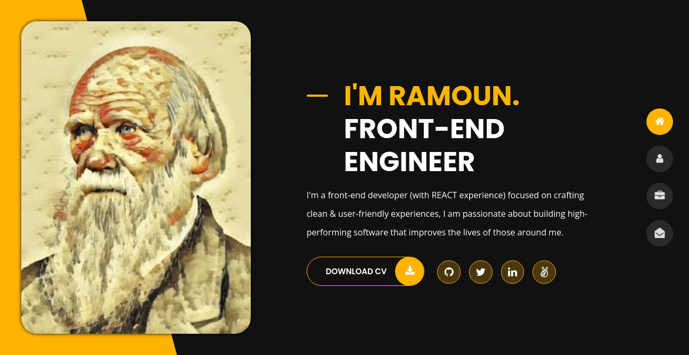
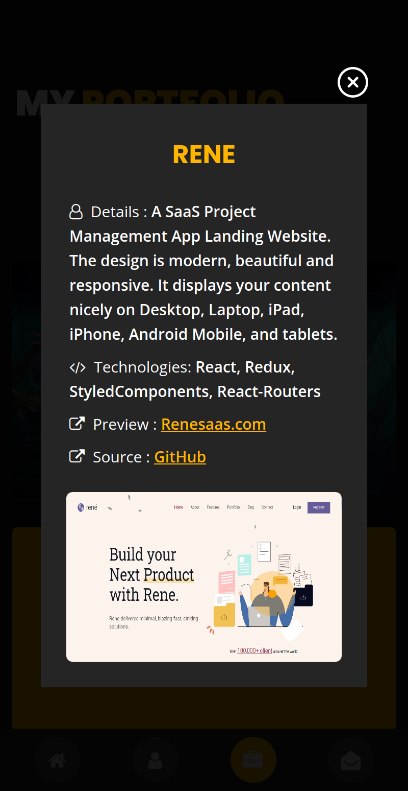
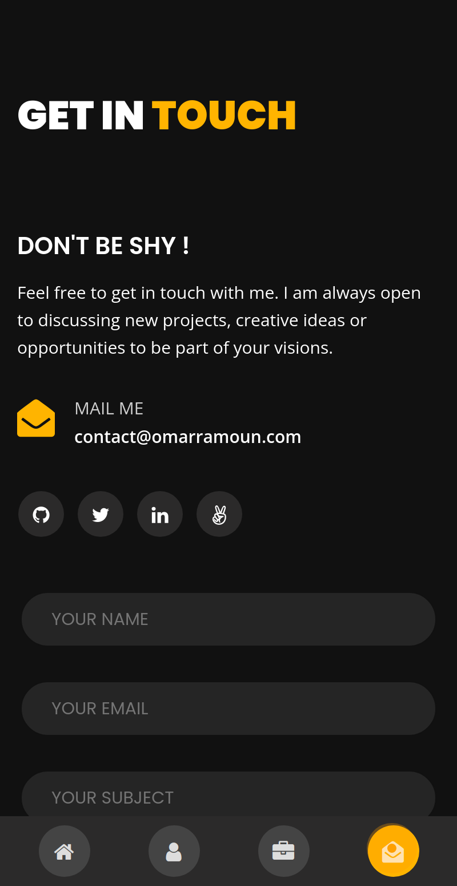

# Sweet Yellow Portfolio

> A Software Engineer Portfolio App Made with React, React-Router, and Bootstrap. The Project Contains a Showcase with Information About Me, All of My Works (Apps), and a Contact Form for Communication.

| *A Screenshot of the Mobile Version of the Portfolio App*

## Screenshots

  
  
  
  

## Built With

- Languages: _**HTML5/Semantics, CSS3/SASS, JS/ES6**_
- Framework: _**React, Redux, Styled-Components, React-Router**_
- Technologies used: _**GIT, GITHUB, LINTERS**_

## Live Demo

[Live Demo Link](https://sweetyellow.omarramoun.com/)

## Authors

👤 **Author1**

- **GitHub**: 
- **Twitter**: 
- **LinkdIn**: 
- **Website**: 

## 🤝 Contributing

Contributions, issues, and feature requests are welcome!

Feel free to check the [issues page](https://github.com/MrRamoun/portfolio/issues).

## Show your support

Give a ⭐️ if you like this project!

## Acknowledgments

- Inspiration
- My Passion For Computers

## 📝 License

This project is [MIT](/LICENSE) licensed.
